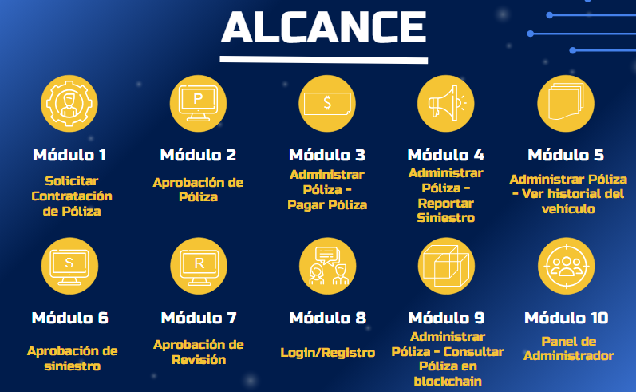
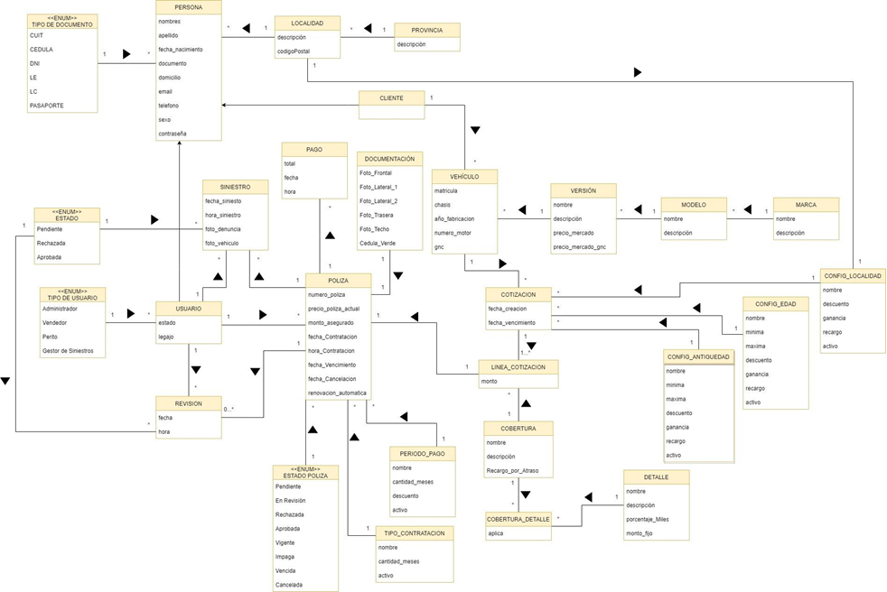
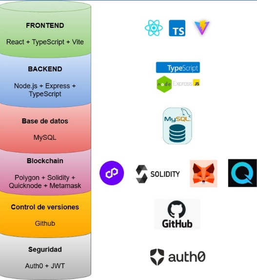

# Car-Chain — API

Backend del sistema de gestión de pólizas de seguro vehicular Car-Chain: cotización paramétrica, emisión, cobro y administración de pólizas, con registro de cada operación en la red Polygon para hacerla verificable e inalterable.

Proyecto final de la carrera de Ingeniería en Sistemas de Información — Universidad Tecnológica Nacional, Facultad Regional Tucumán.

**[Ver demostración en video]([https://www.youtube.com/watch?v=fzim2_93Q-U])** · Frontend: **[car-chain-front-MVC](https://github.com/JuanCarriles/car-chain-front-MVC/tree/main)**

---

## El problema

En el seguro vehicular, buena parte de los conflictos entre asegurado y aseguradora se reduce a una pregunta: **qué decía exactamente la póliza y desde cuándo**. Los registros viven en los sistemas de la propia aseguradora, que es a la vez parte interesada en la disputa. Modificar una fecha de vigencia o una cláusula después de un siniestro es técnicamente trivial, y demostrar que ocurrió es difícil.

Hay un segundo problema, menos evidente y con más impacto económico: **el historial de un vehículo se pierde al cambiar de titular**. Un auto con siniestros graves puede revenderse sin que el comprador ni la aseguradora nueva se enteren, porque cada compañía solo ve lo que pasó bajo su propia póliza.

Car-Chain ataca las dos cosas anclando cada operación crítica en una blockchain pública. La aseguradora opera con normalidad, pero el registro queda fuera del alcance de cualquiera de las partes, y el historial queda asociado al vehículo en lugar de a la compañía.

## Alcance funcional



El sistema cubre el ciclo de vida completo de una póliza, con tres perfiles de usuario: **cliente**, **personal de la aseguradora** (aprobación y peritaje) y **administrador**.

**Ciclo de vida de la póliza**
Solicitar contratación · Consultar cotización · Aprobar póliza · Aprobar revisión · Pagar póliza · Administrar póliza

**Siniestros**
Reportar siniestro · Validar reporte de siniestro

**Verificación en blockchain**
Consultar póliza registrada en la cadena · Ver historial del vehículo

**Configuración paramétrica** (módulo de administración)
Marcas · Modelos · Versiones · Coberturas y sus detalles · Tipos de contratación · Períodos de pago · Parámetros de riesgo por edad del conductor, antigüedad del vehículo y localidad

**Usuarios y acceso**
Registro e inicio de sesión · Gestión de usuarios · Modificación de cuenta de cliente

## Decisiones técnicas

### Cotización paramétrica en lugar de tarifas fijas

La prima no está escrita en el código: se calcula a partir de parámetros que el administrador configura desde el sistema —franjas de edad del conductor, antigüedad del vehículo, localidad de radicación, cobertura y período de pago—. Cuando la aseguradora cambia su política de riesgo, ajusta valores en el panel; nadie toca el código ni se despliega nada.

Es la diferencia entre un prototipo que muestra el flujo y un sistema que una empresa podría operar. También es lo que obligó a modelar el dominio con cuidado: los parámetros de riesgo son entidades propias, no columnas sueltas en la tabla de pólizas.

### De Java JSP + Ethereum a Node + Polygon

La primera versión se desarrolló con Java web sobre JSP y anclaje en Ethereum. En poco más de un año dejó de funcionar, por dos razones que conviene separar.

**El costo de operar sobre Ethereum.** Cada registro en la cadena paga una comisión de red volátil e imprevisible. Para un sistema que ancla una transacción por cada operación de póliza, eso vuelve el costo unitario imposible de proyectar. Polygon ofrece confirmaciones más rápidas y comisiones órdenes de magnitud menores, manteniendo compatibilidad con las mismas herramientas del ecosistema.

**El costo de mantener el stack.** La versión JSP quedó desactualizada y dejó de levantar. Reescribir el backend sobre Node y TypeScript permitió compartir lenguaje y tipos con el frontend y trabajar sobre un ecosistema donde las librerías de blockchain son ciudadanas de primera clase.

*Rehacer un sistema que ya funcionaba no fue una decisión estética: fue la conclusión de que un proyecto que no se puede sostener en el tiempo no está terminado.*


### Modelo de dominio




## Stack

| Tecnología | Rol |
|---|---|
| Node.js + Express 4 | Servidor HTTP y ruteo |
| TypeScript | Tipado en modelos, servicios y controladores |
| Sequelize 6 | ORM, migraciones y seeders |
| MySQL / PostgreSQL | Persistencia |
| ethers.js | Interacción con la red Polygon |
| JWT + bcryptjs | Autenticación por roles y hasheo de credenciales |
| Helmet, CORS, express-validator | Seguridad y validación de entrada |
| Multer | Carga de documentación de siniestros |
| Nodemailer | Correo transaccional |
| node-cron | Tareas programadas (vencimientos y renovaciones) |
| MercadoPago SDK | Cobro de pólizas |




## Arquitectura

```
src/
 ├── models/         Modelos de Sequelize y relaciones
 ├── controllers/    Coordinan request y response
 ├── services/       Lógica de negocio, cotización e interacción con la blockchain
 ├── routes/         Definición de endpoints
 ├── middlewares/    Autenticación, autorización por rol, validación y errores
 └── app.ts          Punto de entrada
scritpDB/            Seeders y scripts de base de datos
```

## Documentación

El desarrollo está documentado en el informe de tesis, que cubre análisis, diseño, desarrollo y pruebas: casos de uso, modelo de dominio, diagramas de secuencia, mockups, casos de uso reales y manual de usuario.

📄 **[Informe completo (PDF)](UTN-FRT_ProyectoFinal_CAR-CHAIN.docx.pdf)**

## Correrlo localmente

```bash
git clone https://github.com/JuanCarriles/car-chain-back-MVC.git
cd car-chain-back-MVC
npm install
cp .env.example .env
npm run migrate
npm run seed
npm run dev
```

| Comando | Qué hace |
|---|---|
| `npm run dev` | Servidor con recarga automática |
| `npm run build` | Compila TypeScript a `dist/` |
| `npm start` | Ejecuta la versión compilada |
| `npm run migrate` | Aplica migraciones |
| `npm run seed` | Carga datos de prueba |

Variables de entorno en `.env.example`: base de datos, secreto de JWT, credenciales de MercadoPago, SMTP y proveedor de red Polygon.

## Estado

Proyecto académico finalizado y defendido. El despliegue de demostración ya no está activo; el funcionamiento completo puede verse en el **[video de demostración](https://www.youtube.com/watch?v=fzim2_93Q-U)**. El código queda publicado como referencia técnica.

---

Desarrollado por [Juan M. Carriles](https://www.linkedin.com/in/juan-maria-carriles-8836512a2/) · juanmcarrile@gmail.com
